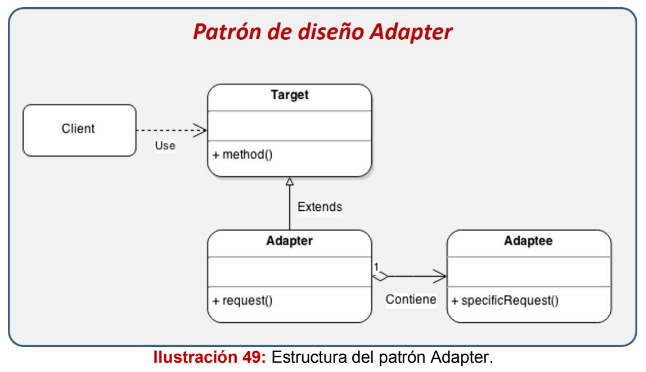
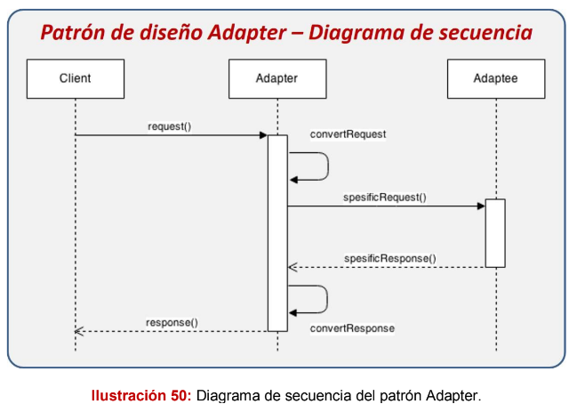
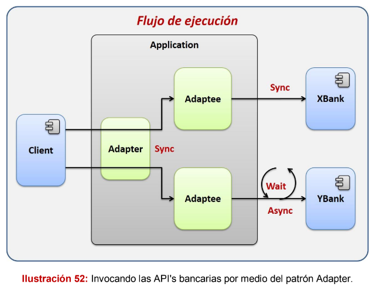

# Patrón Adapter

El patrón de diseño Adapter es utilizado cuando tenemos interfaces de software
incompatibles, las cuales a pesar de su incompatibilidad tiene una funcionalidad
similar. Este patrón es implementado cuando se desea homogeneizar la forma de
trabajar con estas interfaces incompatibles, para lo cual se crea una clase
intermedia que funciona como un adaptador. Esta clase adaptador proporcionará
los métodos para interactuar con la interface incompatible.

### Los componentes que conforman el patrón son los siguientes:
1. Client: Actor que interactua con el Adapter.
2. Target: Interface que nos permitirá homogenizar la forma de trabajar con
las interfaces incompatibles, esta interface es utilizada para crear los
Adapter.
3. Adapter: Representa la implementación del Target, el cual tiene la
responsabilidad de mediar entre el Client y el Adaptee. Oculta la forma de
comunicarse con el Adaptee.
4. Adaptee: Representa la clase con interface incompatible.

### El diagrama anterior se interpreta de la siguiente manera:
1. El Client invoca al Adapter con parámetros genéricos.
2. El Adapter convierte los parámetros genéricos en parámetros específicos
   del Adaptee.
3. El Adapter invoca al Adaptee.
4. El Adaptee responde.
5. El Adapter convierte la respuesta del Adaptee a una respuesta genérica
   para el Client.
6. El Adapter responde al Client con una respuesta genérica.

## ¿Cuándo utilizarlo?
- Cuando buscamos homogeneizar la forma de trabajar con interfaces
incompatibles mediante una interface en común.
- Cuando las interfaces del sistema viejo no se ajustan al nuevo sistema.

## El escenario:
Para este ejemplo imaginaremos que tenemos un sistema encargado de realizar
préstamos personales por medio de bancos. Nuestro sistema lo que hará es
utilizar las API’s proporcionadas por los bancos para comunicarnos con ellos, esto
con el fin de validar si el banco le puede prestar la cantidad solicitada, el sistema
se tendrá que ir a los dos bancos para validar esta información y decirle al cliente
si es posible prestarle el efectivo.

En esta imagen podemos apreciar que el Client no hace invocaciones directas a
las API’s bancarias, en su lugar crea un adaptador para cada API con el fin de
establecer interfaces compatibles para el Client, el cliente consume las API’s por medio de estos adaptadores y se asegura que el mensaje enviado y recibido
siempre será el mismo sin importar la implementación que haya detrás del
Adaptee.

